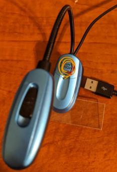
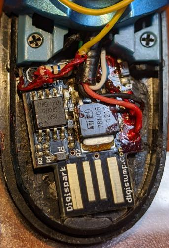
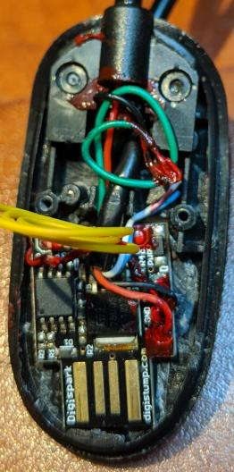
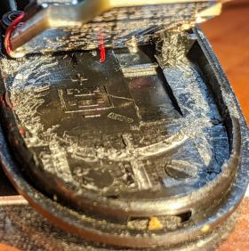

## touch-dim

A simple app using the capacitive touch library to turn a reading light on and off, and to adjust its brightness via pwm.

Short presses turn the light on and off, while long presses adjust the on brightness. Brightness is remembered over on/off cycles but not when the unit loses power.

### hardware

The hardware is a digispark, a tiny board in the arduino ecosystem which uses an ATTINY85, plugs directly into USB-A ports, and emulates USB protocols in software. Specifically, I used a [Model B](https://digistump.com/wiki/digispark/tutorials/modelbi2c) (only shipped to kickstarter supporters), which has an onboard LED connected to Pin 0. The code will still work fine on a Model A, the only difference being that the onboard LED won't light unless you change to pin 1.

#### photos

The lamp, formerly battery- or adapter-powered, now usb-powered.

I originally planned for the touch electrode (yellow wire) to be under the battery lid, but there was more interaction between it and the components than I expected; the board quickly became hot. I suspect this was caused by weakly-terminated inputs changing state quickly, as well as spending time in an intdeterminate state. The problem only showed up when the lid was installed, so initially I thought the lid was simply trapping heat.

Fortunately I was able to notch the lid and put the coil above the back part; in that position there is insufficient interaction for it to cause heating.

The digispark was squeezed into the former battery compartment.

The red compound is nail polish, used to insulate and strengthen. The red and black insulated wires are +5 and GND from the usb cable; the usb data lines (white and barely-visible light blue) are currently unattached and are fed into the back half of the case to keep them out of the way. The through-hole resistor is 10M ohm and part of the touch sense circuit. On the right it connects to P2, while on the left it connects to P5. Its left lead comes from under the board and is soldered to the yellow wire.

Fully open, additional wiring can be seen.

The coiled green wire is an extension of the negative (black) wire to the lamp. Under it can be seen a red wire, which is positive for the lamp and connects to pin 0. The thicker cable is the usb cable, which drops down into the void formerly occupied by the adapter power jack. A knot in the cable there (not visible) serves as strain relief.

There's no going back to batteries - all the plastic that once held them in place, as well as the contacts, had to be removed to make room for the digispark.

#### porting

Nothing in the code should be specific to the digispark, other than pin numbers. Obviously, the digispark makefile will _not_ work with other boards - you'll want to change that dependency or just use the arduino ide. If you encounter trouble, verify that the cap sensing lib can work on your hardware and on the chosen pin, and that the output pin you chose supports pwm.

### qt creator

You may notice a .pro file in the repo. I used it as editor, and this file was to keep it (and its linters) happy. I do not use it to build/upload; that sounds possible but I didn't get around to making it work. Note that if you build from qt creator, it will create a Makefile in the repo root that would compile for your native arch, likely x86. This is not to be confused with the Makefile in src/, which is used to build for ATTINY85 and to upload.

## building

Uses the "arduino makefile for digispark", https://github.com/agusibrahim/Arduino-mk-Digispark . Known to work with rev 8876084013f1c.

You will need to have the appropriate toolchain installed; see instructions on [its wiki](http://digistump.com/wiki/digispark), under __The Original Digispark - Getting started__. It might be possible to install/use that toolchain without the arduino ide installed, but I have not tried.

Once you have Arduino-mk-Digispark and the toolchain installed, edit src/Makefile to update paths as necessary. Then,

`cd src; make`

### yay

If all goes well, proceed to uploading.

### nay

If you encounter errors, first make sure things work with the arduino ide (below). If things don't work there, read through digistump's troubleshooting docs (see its wiki, under _building_ above).

If the ide works but not make, read through the voluminous docs in the Arduino-mk-Digispark Makefile.

## upload

The digispark has a different upload process than vanilla arduinos, though if you've used the arduino ide with a digispark you've already encountered it - the upload process must intercept the digispark's boot process. Run the following with the board unplugged, then follow onscreen prompts to plug it in:

`cd src; make upload`

As with building - if this fails, first make sure it works with the arduino ide. You _must_ follow the onscreen instructions, plugging in only when it is ready.

## I want to use the arduino ide

If you wish to use the arduino ide, rename main.cpp to something with a .ino extension. You might get away with creating a symlink instead of renaming, but no guarantees.
